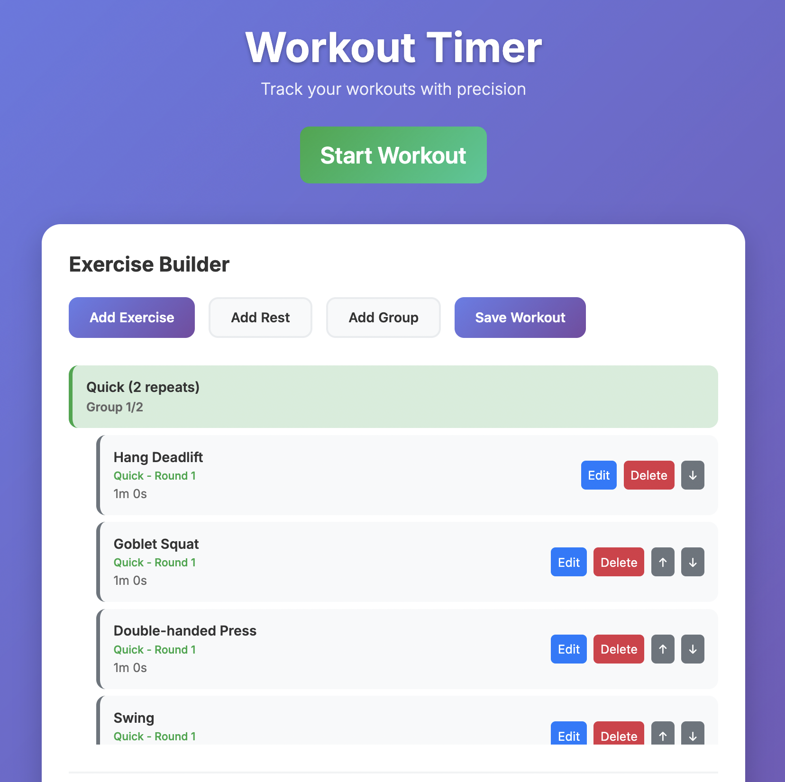

# Workout Timer App

A simple, vibe coded, modern web-based workout timer with local storage for tracking your fitness sessions.

## Try

Try it out at: https://qoqosz.github.io/Workout-Timer/

## Preview



## Features

- **Interval Timer**: Set custom workout and rest intervals
- **Local Storage**: Automatically saves your workout history and settings
- **Responsive Design**: Works perfectly on desktop and mobile devices
- **Keyboard Shortcuts**: Quick controls for better user experience
- **Workout History**: Track your previous workouts with detailed information
- **Modern UI**: Clean, beautiful interface with smooth animations

## How to Use

1. **Open the App**: Simply open `index.html` in your web browser
2. **Configure Settings**:
   - Set your workout duration (in minutes)
   - Set your rest duration (in minutes)
   - Choose the number of intervals
3. **Start Your Workout**: Click the "Start" button or press the spacebar
4. **Control the Timer**:
   - **Start/Pause**: Spacebar or click the Start/Pause button
   - **Reset**: Ctrl+R (Cmd+R on Mac) or click the Reset button
5. **View History**: Your completed workouts are automatically saved and displayed

## Timer Modes

The app automatically cycles between:
- **Workout Phase**: Your main exercise time
- **Rest Phase**: Recovery time between intervals

The timer will automatically switch between these phases based on your settings.

## Keyboard Shortcuts

- **Spacebar**: Start/Pause timer
- **Ctrl+R** (or **Cmd+R** on Mac): Reset timer

## Local Storage

The app automatically saves:
- Your workout history (last 20 workouts)
- Timer settings (workout time, rest time, intervals)
- All data is stored locally in your browser

## Browser Compatibility

Works in all modern browsers:
- Chrome
- Firefox
- Safari
- Edge

## File Structure

```
timer/
├── index.html      # Main HTML file
├── styles.css      # CSS styles
├── script.js       # JavaScript functionality
└── README.md       # This file
```

## Getting Started

1. Download or clone the files to your local machine
2. Open `index.html` in your web browser
3. Start your first workout!

No installation or setup required - it's a pure web app that runs entirely in your browser.

## Customization

You can easily customize the app by modifying:
- **Colors**: Edit the CSS variables in `styles.css`
- **Default Settings**: Change the default values in `script.js`
- **Features**: Add new functionality by extending the JavaScript class

## Privacy

All data is stored locally in your browser's localStorage. No data is sent to external servers or shared with third parties.

Enjoy your workouts! 💪
