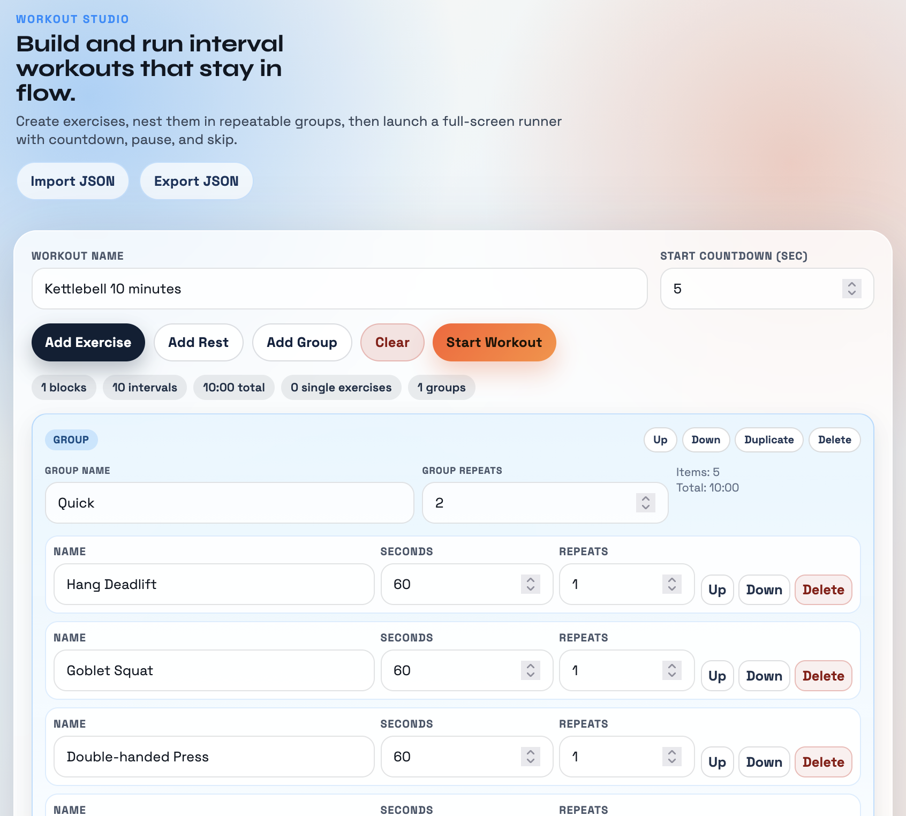

# PulseForge Workout Timer

A modern browser-based workout timer for building structured interval workouts and running them in a full-screen, focused mode.

## Try

Try it at: https://qoqosz.github.io/Workout-Timer/

## Preview



## What Changed

The app was rebuilt with a new workout model and UI:

- Structured workout builder with editable blocks
- Single exercises with per-exercise repeats
- Repeatable exercise groups (circuits)
- Per-item repeats inside groups
- Full-screen runner with clear current-step focus
- Pre-start countdown
- Pause/resume, skip, and stop controls during a run
- JSON import/export
- Persistent state via `localStorage`

## Core Features

- Workout name and configurable countdown (0-30 seconds)
- Exercise blocks:
  - `name`
  - `duration` (seconds)
  - `repeats`
- Group blocks:
  - group `name`
  - group `repeats`
  - nested exercise items, each with:
    - `name`
    - `duration` (seconds)
    - `repeats`
- Block and item management:
  - add
  - reorder
  - duplicate
  - delete
- Live summary of total intervals and workout duration

## Runner Behavior

- Opens as a full-screen overlay
- Shows:
  - current stage (countdown/running/paused/finished)
  - current exercise name
  - interval metadata
  - main timer
  - step and total progress bars
- Controls:
  - Pause/Resume
  - Skip current interval (or skip countdown)
  - Stop/Close

## Keyboard Shortcuts

When runner overlay is open:

- `Space`: Pause/Resume
- `ArrowRight`: Skip current step
- `Escape`: Stop/Close

## Data Persistence

Workout data is saved automatically in browser `localStorage` under:

- `pulseforge-workout-v1`

No backend is used. Data stays in the browser unless exported.

## Import / Export JSON

Use the top-right buttons:

- `Export JSON`: downloads current workout as `.json`
- `Import JSON`: replaces current workout from a selected `.json` file

Supported structure (top-level `workout` is optional):

```json
{
  "version": 1,
  "workout": {
    "name": "Evening Conditioning",
    "countdown": 5,
    "steps": [
      {
        "type": "exercise",
        "name": "Jump Rope",
        "duration": 45,
        "repeats": 2
      },
      {
        "type": "group",
        "name": "Upper Body Circuit",
        "repeats": 2,
        "items": [
          { "name": "Push-ups", "duration": 40, "repeats": 1 },
          { "name": "Rest", "duration": 20, "repeats": 1 },
          { "name": "Plank", "duration": 30, "repeats": 1 }
        ]
      }
    ]
  }
}
```

Validation and clamping are applied on import:

- countdown: `0..30`
- duration: `1..3600`
- repeats: `1..20`

## Getting Started

1. Clone or download this repository.
2. Open `/Users/qoqosz/Documents/Coding/timer/index.html` in a browser.
3. Build your workout and click `Start Workout`.

No install step is required.

## File Structure

```txt
timer/
├── index.html
├── styles.css
├── script.js
├── Screenshot.png
└── README.md
```

## Browser Support

Works in modern Chromium, Firefox, Safari, and Edge builds with standard ES6+ support.
